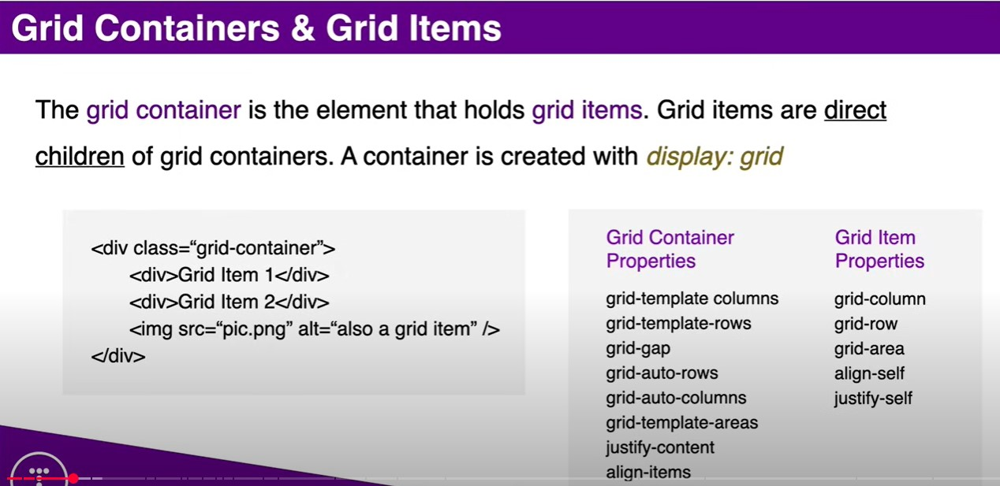

## Links

Original Code:  
https://github.com/bradtraversy/grid-crash

## Slides

## VSCode tips

Создать простой html в VS

    ! + Enter

Создать 9 div'ов с текстом типа "Item 1" и классом "item"

    .item{Item $}*9

Добавлять link'и в head

    link + Enter

Добавление тегов с закрывающими тегами

    header + Enter
    main + Enter
    nav + Enter

